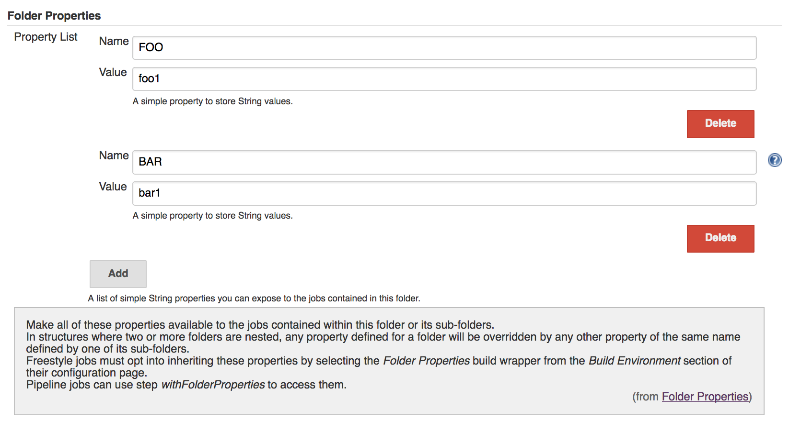
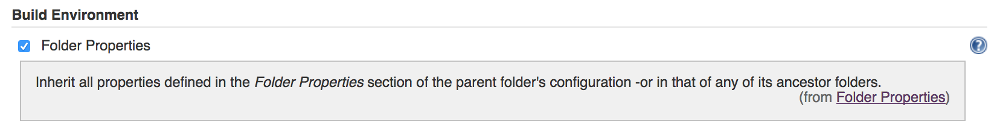
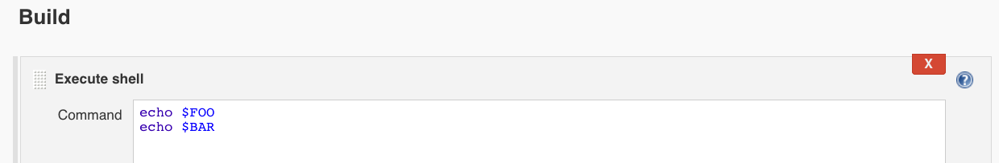
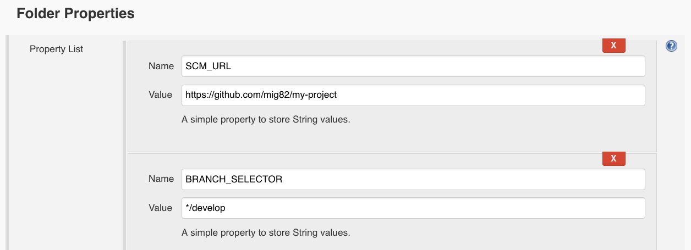
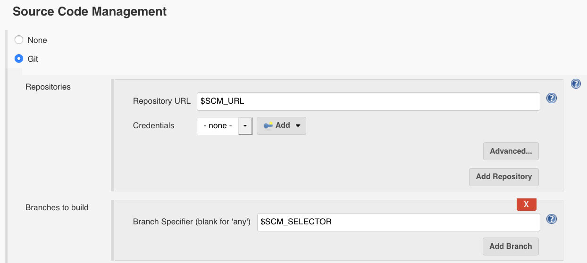
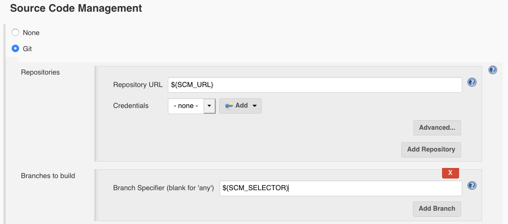

# Folder Properties

The Folder Properties plugin allows users with config permission to define
properties for a folder which can then be used by jobs contained
within it or in any of its sub-folders.

The aim here is to remove the need to specify the same properties over
and over again for all the jobs inside a folder.

## How to use?

To configure, just create a
[folder](https://plugins.jenkins.io/cloudbees-folder/),
go to its configuration page and add as many properties as you need
under the `Folder Properties` section.

In structures where two or more folders are nested, any property defined for a folder will be overridden by any other
property of the same name defined by one of its sub-folders.



## Freestyle Jobs

Freestyle jobs must opt into the `Folder Properties` build wrapper from
the `Build Environment` section of their configuration page in order to
be able to access these properties as they would any other environment
variable.



Only then will they inherit properties defined by their parent or ancestor folders —e.g. Running `echo $FOO` in a Shell build step :



#### SCM Step in Freestyle Jobs

Freestyle jobs can also use folder properties to **define SCM parameters** — e.g. By defining an `SCM_URL` property pointing to the Git repository and a `BRANCH_SELECTOR` property pointing to the branch, tag or commit to be checked out:



Then, descendant freestyle jobs can use that either as `$SCM_URL` and `$BRANCH_SELECTOR` :



 or as `${SCM_URL}` and `${BRANCH_SELECTOR}` :



## Pipeline Jobs

Pipeline jobs can use step `withFolderProperties` to access them :

**Using folder properties in a pipeline job**

``` groovy
withFolderProperties{
    echo("Foo: ${env.FOO}")
}
```

## Job DSL

In Job DSL scripts you can define folder properties like so :

**Job DSL example**

``` groovy
folder('my folder') {
    properties {
        folderProperties {
            properties {
                stringProperty {
                    key('FOO')
                    value('foo1')
                }
            }
        }
    }
}
```

## Authors & Contributors

* [Miguelángel Fernández Mendoza](https://github.com/mig82).
* [GongYi](https://github.com/topikachu).
* [Stefan Hirche](https://github.com/StefanHirche)
* [Deepak Gupta](https://github.com/Mr-DG-Wick)

## References

* [Site](https://plugins.jenkins.io/folder-properties/)
* [Dependencies](https://plugins.jenkins.io/folder-properties/dependencies/)
* [Javadoc](https://javadoc.jenkins-ci.org/plugin/folder-properties/)
